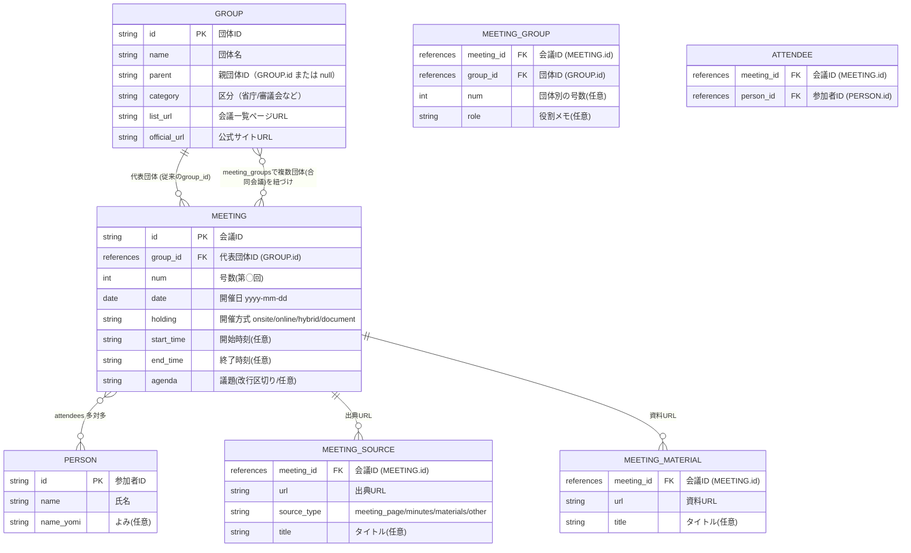

```mermaid
erDiagram
  GROUP ||--o{ MEETING : "代表団体 (従来のgroup_id)"
  MEETING }o--o{ GROUP : "meeting_groupsで複数団体(合同会議)を紐づけ"
  MEETING }o--o{ PERSON : "attendees 多対多"
  MEETING ||--o{ MEETING_SOURCE : "出典URL"
  MEETING ||--o{ MEETING_MATERIAL : "資料URL"

  GROUP {
    string id PK "団体ID"
    string name "団体名"
    string parent "親団体ID（GROUP.id または null）"
    string category "区分（省庁/審議会など）"
    string list_url "会議一覧ページURL"
    string official_url "公式サイトURL"
  }

  PERSON {
    string id PK "参加者ID"
    string name "氏名"
    string name_yomi "よみ(任意)"
  }

  MEETING {
    string id PK "会議ID"
    references group_id FK "代表団体ID (GROUP.id)"
    int num "号数(第◯回)"
    date date "開催日 yyyy-mm-dd"
    string holding "開催方式 onsite/online/hybrid/document"
    string start_time "開始時刻(任意)"
    string end_time "終了時刻(任意)"
    string agenda "議題(改行区切り/任意)"
  }

  MEETING_GROUP {
    references meeting_id FK "会議ID (MEETING.id)"
    references group_id FK "団体ID (GROUP.id)"
    int num "団体別の号数(任意)"
    string role "役割メモ(任意)"
  }

  ATTENDEE {
    references meeting_id FK "会議ID (MEETING.id)"
    references person_id FK "参加者ID (PERSON.id)"
  }

  MEETING_SOURCE {
    references meeting_id FK "会議ID (MEETING.id)"
    string url "出典URL"
    string source_type "meeting_page/minutes/materials/other"
    string title "タイトル(任意)"
  }

  MEETING_MATERIAL {
    references meeting_id FK "会議ID (MEETING.id)"
    string url "資料URL"
    string title "タイトル(任意)"
  }
```
