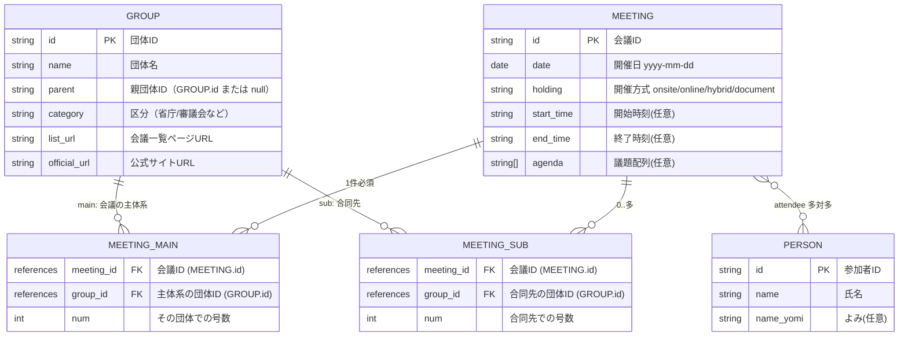

# ERとスキーマ仕様

## 1. スコープとゴール
- 対象モデル：`GROUP` / `MEETING` / `PERSON` の3モデル
- 目的：会議データの構造（ERとフィールド仕様）、ID・バリデーション方針を明文化
- 前提：当面は開発者本人が手動で更新し、全データを公開

## 2. 用語と記法
- 必須/任意の表記、型記法を明示する
- IDはCLIで採番するUUIDとする（登録用JSONではname参照を許容）
- 登録用JSON：`register/` に置く下書き。参照はnameで書いてよい
- 確定データJSON：`data/` に保存する本番データ。参照はUUIDのみ
- 日付/時刻/URL/文字列のフォーマット定義をここに記す（後述埋め）

## 3. ER図（参考）

## 4. エンティティ別フィールド仕様
- 各テーブルごとにフィールド、必須/任意、型、制約、例を整理する（内容は後で埋める）

### 4.1 GROUP
| フィールド   | 必須 | 型     | 制約・説明      | 例  |
| ------------ | ---- | ------ | --------------- | --- |
| id           | 必須 | string | UUID（CLI採番） |     |
| name         | 必須 | string | トリム後非空    |     |
| parent       | 任意 | string | 親GROUPのUUID   |     |
| category     | 必須 | string | 任意文字列      |     |
| list_url     | 任意 | string | URL形式         |     |
| official_url | 必須 | string | URL形式         |     |

### 4.2 PERSON
| フィールド | 必須 | 型     | 制約・説明         | 例  |
| ---------- | ---- | ------ | ------------------ | --- |
| id         | 必須 | string | UUID（CLI採番）    |     |
| name       | 必須 | string | トリム後非空       |     |
| name_yomi  | 任意 | string | トリム、空ならnull |     |

### 4.3 MEETING
| フィールド | 必須 | 型                                               | 制約・説明                                                       | 例  |
| ---------- | ---- | ------------------------------------------------ | ---------------------------------------------------------------- | --- |
| id         | 必須 | string                                           | UUID（CLI採番）                                                  |     |
| main       | 必須 | MainMeetingRef                                   | 常に1件。合同委員会単独開催時もここに合同委員会のID/号数を入れる |     |
| sub        | 任意 | List[SubMeetingRef]                              | 合同会議に紐づく団体別号数を列挙。なければ空                     |     |
| date       | 必須 | string                                           | yyyy-mm-dd                                                       |     |
| holding    | 必須 | `"onsite" \| "online" \| "hybrid" \| "document"` | トリム後非空                                                     |     |
| start_time | 任意 | string                                           | hh:mm など、トリム空ならnull                                     |     |
| end_time   | 任意 | string                                           | hh:mm など、トリム空ならnull                                     |     |
| agenda     | 任意 | List[string]                                     | 議題配列。要素はトリムし空要素は除外                             |     |
| attendee   | 任意 | List[string]                                     | PERSONのUUID配列（登録時はname配列可）                           |     |
| sources    | 任意 | SourcesObject                                    | 会議ページ/逐語録/告知URLとその他配列                            |     |
| materials  | 任意 | List[Material]                                   | url必須                                                          |     |

※ `attendee` はコード上のフィールド名に合わせて単数表記。登録用JSONではnameで記述し、CLIでUUIDへ解決。

#### SourcesObject（MEETING配下）
| フィールド   | 必須 | 型                | 制約・説明        | 例  |
| ------------ | ---- | ----------------- | ----------------- | --- |
| meeting_page | 任意 | string \| null    | 会議ページURL     |     |
| transcript   | 任意 | string \| null    | 議事録/逐語録URL  |     |
| announcement | 任意 | string \| null    | 開催案内・告知URL |     |
| other        | 任意 | List[SourceOther] | 任意件数。url必須 |     |

#### SourceOther（MEETING.sources.other[]）
| フィールド | 必須 | 型     | 制約・説明         | 例  |
| ---------- | ---- | ------ | ------------------ | --- |
| url        | 必須 | string | トリム後非空       |     |
| title      | 任意 | string | トリム、空ならnull |     |

#### Material（MEETING配下）
| フィールド | 必須 | 型     | 制約・説明         | 例  |
| ---------- | ---- | ------ | ------------------ | --- |
| url        | 必須 | string | トリム後非空       |     |
| title      | 任意 | string | トリム、空ならnull |     |

#### MainMeetingRef（MEETING.main）
| フィールド | 必須 | 型     | 制約・説明                        | 例  |
| ---------- | ---- | ------ | --------------------------------- | --- |
| group_id   | 必須 | string | GROUPのUUID（登録時はname参照可） |     |
| num        | 必須 | int    | その団体での号数                  |     |

#### SubMeetingRef（MEETING.sub[]）
| フィールド | 必須 | 型     | 制約・説明                        | 例  |
| ---------- | ---- | ------ | --------------------------------- | --- |
| group_id   | 必須 | string | GROUPのUUID（登録時はname参照可） |     |
| num        | 必須 | int    | 団体別号数                        |     |

## 5. データファイル配置
- 基本形：`data/{entity}/{uuid}.json` を標準とする（例：`data/group/{uuid}.json`、`data/person/{uuid}.json`）
- MEETINGのみ拡張：`data/meeting/{uuid}/` 配下に複数ファイルで分割する
  - `data/meeting/{uuid}/basic.json`：`id`、`main`、`sub`、`date`、`holding`、`start_time`、`end_time`、`agenda`、`sources`（meeting_page/transcript/announcement/other配列）、`materials` を格納
  - それ以外（逐語録や資料など）は用途に応じたファイル名で追加（例：`materials.json`、`transcript.json` など、今後定義）
- register用の下書きは `register/{entity}/...`（構造はdata用に準ずるがID未指定・name参照可）

## 6. ID・バリデーション方針
- ID採番：CLIでUUIDを自動付与（登録用JSONではID未指定でよい）
- name参照：登録用JSONでは `group_id` や `attendees` を name で記述可。CLI実行時に既存UUIDへ解決し、未登録nameは新規UUIDを割り当てる
- ユニーク制約：`GROUP.name` 等の一意性要件を定義する
- 参照整合性：確定データではUUID参照のみとし、孤児データを禁止
- バリデーション：URL形式、日付/時刻形式、必須チェック、文字数上限を定義
